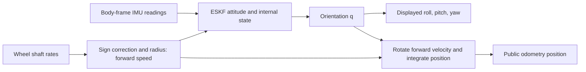

# Learn the rover code through the mechanics

This guide is for the engineer responsible for the rover, including someone
learning Python for the first time. Start with the physical behavior you need to
understand: **when the rover turns, how does it estimate the angle?**

The first working lesson is [09 — turn angle](09_turn_angle_lesson.md).
The current inspection findings are in [10 — code review](10_code_review.md).
The older theory and implementation documents remain useful, but are in Korean.
This learning path and its first lesson are in English.

## 1. What “understand every line” should mean

For each block of your own code, be able to explain:

1. What physical or software problem does it solve?
2. What enters it: values, units, coordinate frame, and array shape?
3. What does each statement calculate or change?
4. What assumption makes the calculation valid?
5. How could you tell that assumption or implementation was wrong?

You do not need to memorize Python, NumPy, Flask, or the motor SDK. You do need
to understand the contracts at their boundaries: for example, whether an SDK
call reports a transmitted packet or an acknowledged motor response.

An ME background gives you a useful starting point: kinematics, coordinate
transforms, integration, measurement uncertainty, and checking dimensions. Learn
the Python that expresses each of those ideas as you encounter it.

## 2. Use this study loop

Work on one function or roughly 10–30 lines at a time.

**Physical question → equation and units → hand calculation → code → prediction
→ offline run → explanation.**

For a turn-angle example:

- Question: how far does the rover turn at 30 degrees/s for 3 seconds?
- Equation: `angle = angular_rate × time`, so the answer is 90 degrees.
- Disturbance: a +0.5 degrees/s gyro bias adds 1.5 degrees of error.
- Code: subtract the estimated bias, multiply by the actual time interval,
  then accumulate a rotation.
- Experiment: set the bias estimate to zero and predict the result before running.
- Explanation: describe why the answer changed without looking at this guide.

Keep a notebook with four columns: **equation / code expression / units and frame
/ assumption or failure case**. Record your prediction before the observed result.
An unexpected result is a useful question to investigate, not a reason to tune a
constant until the output looks right.

When using an assistant, ask: “Explain these 15 lines, including every Python
operator, the units and shapes, and the physical assumptions. Then give me one
numerical prediction to make before showing the answer.” Try the prediction yourself.

## 3. Start without hardware

From the project root, these commands perform calculations or read existing logs:

```powershell
python -B rover/learn_turn_angle.py
python -B rover/test_filter.py
python -B rover/replay_gui.py
```

The first command is the starting lesson. The second runs the existing math and
simulation checks and may take several minutes. The third opens the local replay
tool; use its timeline and `Filter cycle` panel to inspect a recorded sample.
An offline replay recomputes the estimate using today's code and configuration.
It does not automatically reconstruct the exact configuration used on recording day.

The pipeline test requires an explicit fake mode to avoid hardware. Its output
file is deleted by default, so give it a new temporary name:

```powershell
$lessonLog = Join-Path $env:TEMP ("rover-lesson-" + [guid]::NewGuid() + ".csv")
python -B rover/test_pipeline.py --fake --seconds 5 --log $lessonLog
```

Dependencies are listed in [requirements.txt](../requirements.txt). If setting up
a new environment, use `python -m pip install -r requirements.txt` from the root.
This list is not a lock file. The reviewed desktop environment is recorded in [10](10_code_review.md).
Jetson camera dependencies belong to the JetPack environment and need separate setup.

Use debugger breakpoints only in the lesson, tests, and offline replay while
learning. Pausing a live motor-control loop also pauses its software stop logic.
Do not run `teleop.py`, `dxl_control.py`, or Jetson deployment scripts as an
experiment in learning Python syntax.

## 4. The order to learn this project

Advance when you can answer the check question; completing a reading session is
not the same as understanding its contents.

| Stage | Physical/software question | Code to study | Check before continuing |
|---|---|---|---|
| 1. Python through angle | How does rate become angle? | [lesson](../rover/learn_turn_angle.py), `eskf.predict()` rotation block | Predict raw and corrected angles for a known bias. |
| 2. Wheel kinematics | How does shaft speed become forward speed? | `config.WHEELS`, `wheel_speeds_mps()`, `body_velocity()` | Explain the right-wheel sign and `v = rω` with units. |
| 3. Coordinates | Which way does a measured vector point? | `ARDUINO_IMU_TO_BODY`, `ArduinoIMU.read()`, `quat_to_rot()` | Map sensor +Y to body −X, and body +X to world +Y at yaw +90 degrees. |
| 4. Startup and time | What establishes the initial heading and bias? | `StillnessDetector`, `_collect_alignment()`, `Odometry.step()` | Explain why movement resets alignment and why yaw starts at zero. |
| 5. Translation | Why does the displayed rover move? | final pose block in `Odometry.step()`, `snapshot()` | Distinguish public wheel-integrated position from internal ESKF position. |
| 6. Estimation basics | How should two uncertain estimates be combined? | scalar example below, then `model_wheel_velocity()` and `_ekf_update()` | Calculate innovation, gain, and corrected velocity by hand. |
| 7. Error-state filter | Why 15 error states and a quaternion? | `create_state()`, `predict()`, `_inject()`, five `model_*` functions | Label every block of `P`, `F`, and one `H`; explain their units. |
| 8. Evidence | How do we know a result is credible? | `sim.py`, `test_filter.py`, `replay.py`, `analyze_drive.py` | Distinguish a passing test, consistent NIS, and measured accuracy. |
| 9. Hardware and failure | What if a sample or command does not arrive? | readers, control, logging, `record.py`, `teleop.py` | Trace the failure path as carefully as the successful path. |
| 10. Interfaces | How do data reach a browser or camera stream? | dashboards, firmware, Jetson tools | Trace one value through serialization, transport, and display. |

This sequence reaches every application layer. It deliberately starts with the
turn-angle question before the full Kalman derivation.

The key relationship to keep in view is:



Alignment, stillness gates and individual measurement updates are omitted from
this overview. Internal ESKF position is a separate diagnostic output.

## 5. Python you need first

| Syntax from this project | Meaning | Engineering connection |
|---|---|---|
| `dt = 0.01` | Assign a value to a name. | Sample interval in seconds; the unit is documented, not enforced by Python. |
| `angle += rate * dt` | Replace `angle` with its old value plus the increment. | Numerical integration. |
| `state['bg']` | Look up the key `'bg'` in a dictionary. | Retrieve the gyro-bias vector from the state. |
| `gyro[2]` | Take the third component; indexing starts at zero. | Body z angular-rate component. |
| `vector[3:6]` | Take indices 3, 4, 5; the endpoint is excluded. | Select one three-component error-state block. |
| `np.array([x, y, z])` | Construct a NumPy numerical array. | Store a 3-vector. Shape `(3,)` is not an explicit `(3,1)` column. |
| `R @ vector` | Matrix multiplication. | Rotate a vector between frames. |
| `a * b` | Scalar multiplication or element-by-element array multiplication. | It is not matrix multiplication. |
| `F.T` | Transpose. | Appears in `F @ P @ F.T`. |
| `value**2` | Square a value. | Convert standard deviation to variance. `^` is not exponentiation in Python. |
| `for _ in range(steps):` | Repeat the indented block; `_` marks an unused loop index. | Advance one simulated sample at a time. |
| `if condition:` | Execute its indented block only when true. | Gate an update using a measurement-quality condition. |
| `def ...` / `return ...` | Define a function / return its result. | A reusable calculation with specified inputs and outputs. |
| `class Odometry` / `self.state` | Group persistent data and operations in an object. | Retain the estimated state between samples. |
| `gyro=..., accel=...` | Name arguments at a call site. | Reduce the chance of swapping same-shaped sensor vectors. |
| `.copy()` | Make independent array storage. | Keep a historical position from changing when the current state changes. |
| `try` / `finally` | Run cleanup when leaving the protected block, including after exceptions. | Release a port or request a motor stop; only covers code inside the `try`. |
| `if __name__ == '__main__':` | Run this block when executing a file directly. | Allow importing its functions without starting its main program. |

Do not assume every file has the last protection: the old Jetson `exp_probe.py`
and `fps_probe.py` perform camera work at module level.

## 6. Quantities that must not be confused

| Name | Units / shape | Meaning in this code |
|---|---|---|
| `gyro` | rad/s, `(3,)` | Body-frame angular-rate reading; bias still included on entry to `predict`. |
| `accel` | m/s², `(3,)` | Accelerometer specific force, not already gravity-free world acceleration. |
| `bg`, `ba` | rad/s and m/s², each `(3,)` | Estimated gyro and accelerometer biases. |
| `q` | unitless, `(4,)`, `[w,x,y,z]` | Orientation mapping body vectors into world coordinates. |
| `p`, `v` | m and m/s, each `(3,)` | Internal nominal ESKF position and velocity, in world coordinates. |
| `Odometry.position` | m, `(3,)` | Public position integrated from wheel speed and ESKF attitude. |
| `P` | `(15,15)` | Error covariance. Diagonal entries are variances; cross entries have products of the corresponding units. |
| `Q` | `(15,15)` | Per-step process-noise covariance in the prediction. |
| `R` in `quat_to_rot` use | `(3,3)`, unitless | Rotation matrix. |
| `R` in `_ekf_update` | `(m,m)` | Measurement-noise covariance; `m` here means number of residual components, not metres. |
| `R_WHEEL_VELOCITY` | m/s | Despite its name, a **standard deviation**; squared when constructing measurement covariance. |
| `WHEELBASE_M` | m | Legacy name for **left–right track width**, not front–rear axle spacing. |
| `stopped` / `zupt_active` | Boolean | A detector result / intended held-stop status. The disabled-ZUPT inconsistency is recorded in [10](10_code_review.md). |

The nominal state stores 16 scalars: `3+3+4+3+3`. The error state has 15:
`3+3+3+3+3`. Orientation uses a unit quaternion for the nominal state and a local
three-component rotation error for the correction.

For translation, check this example: wheel shaft rates `[2,-2,2,-2] rad/s`,
multiplied by signs `[+1,-1,+1,-1]` and radius `0.0625 m`, all give `+0.125 m/s`.
The current public model assumes the mean of these speeds is body forward speed.
Slipping wheels violate that assumption.

## 7. Learn one scalar Kalman update before the matrix version

Suppose predicted forward velocity is `0.12 m/s` with standard deviation
`0.02 m/s`, and an independent measurement is `0.16 m/s` with standard deviation
`0.01 m/s`. For this simplified scalar example:

```text
P = 0.02² = 0.0004 (m/s)²       R = 0.01² = 0.0001 (m/s)²
innovation y = 0.16 - 0.12 = 0.04 m/s
innovation variance S = P + R = 0.0005 (m/s)²
gain K = P / S = 0.8
corrected velocity = 0.12 + 0.8 × 0.04 = 0.152 m/s
corrected variance = (1 - 0.8) × 0.0004 = 0.00008 (m/s)²
NIS = y² / S = 3.2
```

Now follow the matching operations in `_ekf_update()`: `y`, `S`, `K`, Joseph
covariance update, and `_inject()`. The real implementation has coupled states,
nonlinear observation models and, for some updates, a yaw-preserving constraint.
The scalar example teaches the mechanism; it is not a replacement derivation.

The expected NIS for a correctly modeled scalar observation is 1 **over an
ensemble**. A single value of 3.2 does not prove the filter is wrong. The project's
0.33–3 mean-ratio display band is a heuristic, not a formal confidence test.
Wrong geometry, timing, bias, model assumptions, `Q`, or `R` can all affect it.

## 8. Complete source map

“Offline” describes the named use, not permission to execute every standalone
test block in a file. Preserve `logs/`: these are experimental inputs.

### Rover Python and browser code

| File | Responsibility | How to study / effect |
|---|---|---|
| [config.py](../rover/config.py) | Hardware settings, units, geometry, noise and gates. | First reference; importing defines values without opening ports. |
| [learn_turn_angle.py](../rover/learn_turn_angle.py) | Known-angle teaching experiment using the real predictor. | Offline starting point; writes no files. |
| [eskf.py](../rover/eskf.py) | Quaternion algebra, state, prediction, observations, updates, trace. | Pure calculation; study in the staged order above. |
| [odometry.py](../rover/odometry.py) | Wheel conversion, stillness, alignment, update order, public pose. | The central cycle shared by live and offline callers. |
| [sim.py](../rover/sim.py) | Synthetic trajectories and sensor samples with known truth. | Offline; its slip parameter multiplies wheel readings, not a general terrain model. |
| [test_filter.py](../rover/test_filter.py) | Numerical Jacobians, invariants and scenario checks. | Offline evidence for assumptions covered by those tests. |
| [imu_reader.py](../rover/imu_reader.py) | Fake, Arduino and planned BMI088 IMU interfaces. | Fake is offline; Arduino opens serial; `RealIMU` is a stub. |
| [dxl_reader.py](../rover/dxl_reader.py) | Port management, Sync Read, signed conversion to SI. | Hardware reads; start by tracing one returned wheel dictionary. |
| [dxl_control.py](../rover/dxl_control.py) | Mode, torque, goal-velocity commands and stop. | **Actuation**; inspect before any motor-enabled run. |
| [dxl_tool.py](../rover/dxl_tool.py) | Port/baud/ID discovery and register diagnostics. | Hardware read operations; interpret each register using vendor docs. |
| [sdk_path.py](../rover/sdk_path.py) | Select the bundled SDK on Python's import path. | Explains which dependency is actually imported. |
| [logger.py](../rover/logger.py) | CSV schema, filenames, serialization and legacy replay conversion. | Creates files when logging; explicit existing filenames can be overwritten. |
| [record.py](../rover/record.py) | Periodic sensor collection, estimation and recording. | Hardware and file I/O; does not command driving. |
| [test_pipeline.py](../rover/test_pipeline.py) | Timing, logging and replay audit. | Use `--fake` and a unique temporary `--log` while learning. |
| [replay.py](../rover/replay.py) | Recompute a log, report NIS and optionally plot. | Offline; plotting writes the requested output file. |
| [analyze_drive.py](../rover/analyze_drive.py) | Compare reach, return and lateral motion with external measurements. | Offline; distinguish estimated path length from tape-measured reach. |
| [replay_gui.py](../rover/replay_gui.py) | Replay backend, experiment metadata, frame/trace API. | Offline local web server; calls production odometry. |
| [templates/replay.html](../rover/templates/replay.html) | HTML structure, CSS appearance, JavaScript playback and plots. | Study one API field from response to displayed number. |
| [teleop.py](../rover/teleop.py) | Joystick web server and live sensing/control loop. | **Actuation** in normal mode; contains embedded HTML/JavaScript. |
| [live_panel.py](../rover/live_panel.py) | Telemetry preparation and embedded dashboard. | Observe live data; separate Python payload code from browser rendering. |
| [vendor/PATCHES.md](../rover/vendor/PATCHES.md) | Record of the local DYNAMIXEL SDK change. | Read before upgrading or replacing the bundled SDK. |

`rover/vendor/dynamixel_sdk/` is third-party implementation code. Learn the calls
this rover relies on and the local patch first; a line-by-line SDK audit is a
separate task from understanding the application's own source.

### Firmware and camera subsystem

| File | Responsibility | Effect / prerequisite |
|---|---|---|
| [imu_stream.ino](../arduino/imu_stream/imu_stream.ino) | Arduino C++ initialization, fresh IMU reads and serial CSV lines. | Needs the board and Arduino IMU library; flashing changes firmware. |
| [cam_stream.py](../jetson/cam_stream.py) | HTTP MJPEG preview. | Opens camera and network server; existing server handles one request at a time. |
| [cam_burst.py](../jetson/cam_burst.py) | Capture a timed burst and save results. | Opens camera, holds frames in memory and writes files. |
| [cam_test.py](../jetson/cam_test.py) | Basic camera capture probe. | Camera and output files. |
| [band_probe.py](../jetson/band_probe.py) | Image-band/frequency diagnostic. | Camera experiment; inspect sampling assumptions. |
| [exp_probe.py](../jetson/exp_probe.py) | Exposure experiment. | Opens camera at module level; do not casually import. |
| [fps_probe.py](../jetson/fps_probe.py) | Frame-rate experiment. | Opens camera at module level; do not casually import. |
| [v4l_ctrl.py](../jetson/v4l_ctrl.py) | Linux V4L2 control access through ioctl. | OS/device-specific reads and writes. |
| [v4l_formats.py](../jetson/v4l_formats.py) | V4L2 format enumeration. | Linux camera device queries. |
| [cam_check.sh](../jetson/cam_check.sh) | Shell diagnostics for connected cameras. | Jetson/Linux tools and devices. |
| [cam_defaults.sh](../jetson/cam_defaults.sh) | Apply camera settings. | Device-control writes; contains deployment-path assumptions. |
| [rec_h264.sh](../jetson/rec_h264.sh) | GStreamer hardware-encoded recording. | Jetson encoder/plugins and output files. |
| [camtest.ps1](../jetson/camtest.ps1) | Windows-to-Jetson SSH/capture workflow. | Stops a remote stream, deletes named remote scratch paths, downloads files; inspect paths before use. |

Project documents explain design and experiment history. `logs/experiments.json`
describes manual measurements, not filter tuning. Images, recordings, and CSVs are
data, not source code. `.vscode/settings.json` configures the editor;
`requirements.txt` lists desktop dependencies; `.gitignore` lists generated
Python files to exclude if version control is introduced.

## 9. Questions to answer before advancing to slip handling

- Can I calculate the effect of a bias and a wrong `dt` on turn angle?
- Can I explain why +360 degrees of accumulated turn may display as zero yaw?
- Can I distinguish a body z gyro rate from Euler yaw rate on a tilted rover?
- Can I explain why stationary gravity tells us tilt but not heading?
- Can I identify which output uses wheel speed directly, bypassing filtered velocity?
- Can I compare a measured physical turn with the estimate, including overshoot
  and post-stop correction, without treating the motor command as ground truth?

The next physical experiment should establish turn-angle accuracy. Only then is
it useful to ask whether wheel/gyro disagreement is caused by slip, geometry,
timing, gyro bias, or an implementation error.

## 10. References to use selectively

- [Official Python tutorial](https://docs.python.org/3/tutorial/): use sections on
  numbers, control flow, functions, data structures, modules and exceptions as
  references while working through the example. The tutorial assumes some general
  programming familiarity; do not make reading it cover to cover a prerequisite.
- [NumPy beginner guide](https://numpy.org/doc/stable/user/absolute_beginners.html):
  arrays, shapes, indexing and arithmetic for the numerical layer.
- [Solà, Quaternion kinematics for the error-state Kalman filter](https://arxiv.org/abs/1711.02508):
  study after the scalar update and coordinate-frame exercises. Match quaternion
  ordering and local/global error conventions before comparing equations.

Your first session can end after running the angle lesson, explaining its bias
subtraction and integration lines, and predicting the full-turn example. That is
a concrete piece of the real estimator understood and checked.
