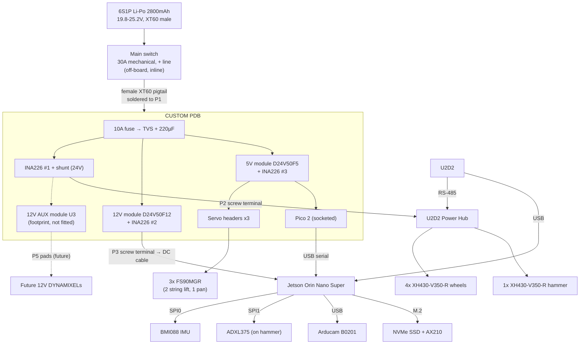

# Rover — Power Distribution Board (PDB) & Electronics Design Handover

| | |
|---|---|
| **Document** | PDB / Schematic & PCB Design Handover |
| **Project** | KSRC Lunar Rover (4-wheel mothership) |
| **Compute** | NVIDIA Jetson Orin Nano Super Dev Kit |
| **Real-time I/O MCU** | Raspberry Pi Pico 2 H (RP2350) — socketed |
| **Mass constraint** | Total system ≤ 3 kg |
| **Design principle** | Essentials only on the board — every part is a potential point of failure. Extensions are documented in §10, not fitted. |

> **Purpose:** Complete interface, power, and connector specification for laying out the PDB and wiring the rover electronics.

---

## 1. System Overview

- **Jetson Orin Nano Super** — vision, teleoperation link, IMU sampling (SPI), high-level commands.
- **Pico 2 (RP2350)** — hard-real-time PWM servo control and current sensing (INA226). Talks to the Jetson over **USB serial**.
- **5× DYNAMIXEL XH430-V350-R** (4 wheels + 1 hammer) — identical, 24V, RS-485, on a single bus through one **ROBOTIS U2D2 + one U2D2 Power Hub** (not part of the PDB).

**The PDB owns:** battery input + protection, 24V distribution, 12V and 5V conversion, current sensing on all three rails, the Pico 2 socket, and the servo headers.

**Not on the PDB:** the main power switch (inline on the battery lead), the Jetson (fed 12V by cable), the IMUs (wired to the Jetson header).

---

## 2. Component Interface List

| # | Component | Qty | Power | Current (idle / peak) | Protocol | Signal lines | Connects to |
|---|-----------|-----|-------|----------------------|----------|--------------|-------------|
| 1 | Jetson Orin Nano Super | 1 | 12V (barrel 5.5×2.5, accepts 9–19V) | 2.1A / **3A** | — | — | P3 via DC cable |
| 2 | XH430-V350-R (wheels) | 4 | 24V | 36mA / **0.7A stall ea** | DYNAMIXEL 2.0 RS-485 | D+, D−, VDD, GND | U2D2 + Power Hub |
| 3 | XH430-V350-R (hammer) | 1 | 24V | 36mA / **0.7A stall** | DYNAMIXEL 2.0 RS-485 | D+, D−, VDD, GND | U2D2 + Power Hub |
| 4 | FS90MGR (string lift) | 2 | 5V | 10mA / **0.8A stall ea** | PWM 50Hz, 900–2100µs, 3.3V logic | PWM, 5V, GND | J5, J6 (independent PWM each) |
| 5 | FS90MGR (camera pan) | 1 | 5V | 10mA / 0.8A | PWM, 3.3V logic | PWM, 5V, GND | J7 |
| 6 | Pico 2 H (RP2350) | 1 | 5V (VSYS) | ~100mA | USB serial | USB | Socket + Jetson USB |
| 7 | BMI088 (Bosch Shuttle Board 3.0) | 1 | 3.3V | 5mA | SPI, 2× CS | SCK, MOSI, MISO, CSB1, CSB2, INT1, INT3 | Jetson SPI0 (§5) |
| 8 | ADXL375 (on hammer) | 1 | 3.3V | 0.1mA | SPI 4-wire | SCK, MOSI, MISO, CS, INT1 | Jetson SPI1 (§5) |
| 9 | INA226 | 3 | 3.3V (Pico 3V3 OUT) | 0.4mA | I²C + ALERT | SDA, SCL, ALERT | Pico I²C0 |
| 10 | NVMe SSD 256GB | 1 | slot | 1–2A peak | PCIe | M.2 M-key 2280 | Jetson |
| 11 | Intel AX210NGW | 1 | slot | 0.5A | PCIe + USB | M.2 E-key, 2× MHF4 antennas | Jetson |
| 12 | Arducam B0201 (IMX291, 120°, UVC) | 1 | USB 5V | 0.3–0.5A | USB 2.0 | USB-A | Jetson |
| 13 | U2D2 | 1 | USB 5V (logic) | 50mA | USB↔RS-485 | micro-USB → USB-A | Jetson |

---

## 3. Power Architecture

### 3.1 Rails

| Rail | Source | Feeds |
|------|--------|-------|
| **24V** (19.8–25.2V) | Battery, after fuse and INA226 #1 shunt | P2 → Power Hub → 5× XH430 |
| **12V** | Pololu **D24V50F12** | P3 → Jetson only (barrel jack — the Jetson's USB-C is data-only) |
| **5V** | Pololu **D24V50F5** (5A) | Servo headers J5–J7 + Pico 2 VSYS |
| **3.3V** | Pico 2 **3V3(OUT)** | INA226 ×3, I²C pull-ups. IMUs take 3.3V from the Jetson header |

### 3.2 Power budget

| Rail | Loads | Peak | Battery-side current at 24V |
|------|-------|------|------------------------------|
| 24V | 5× XH430 | ~3.5A | ~3.5A |
| 12V | Jetson (25W) | ~3A | ~1.6A |
| 5V | 3× FS90MGR + Pico | ~2.5A | ~0.6A |
| **Total** | | | **~6A worst case** |

**Fuse: 10A standard automotive blade fitted today — input path built for 20A.** The fuse's job is short-circuit and fire protection (a LiPo can deliver 100A+), not current limiting; a fuse near 6A would blow during normal simultaneous peaks. The P1 pads, fuse clips (≥30A), 24V copper and RS1 are all sized for **20A**, so future heavy loads only require swapping the blade fuse (15A / 20A) — no board change. Never run without a fuse: a chafed wire shorting to the frame would let the battery melt the wiring.

Battery: 6S 2800mAh ≈ 62Wh → ~1.2–1.6 h at 30–40W average.

### 3.3 Input chain

1. **Main switch (off-board):** 30A 12/24V mechanical switch inline on the **positive** battery lead, mounted on the rover exterior (e-stop). Keep a spare.
2. **Battery lead:** battery has a **male** XT60 → **female XT60 pigtail**, 12–14 AWG, soldered into **P1**. Cap the battery plug when disconnected (its pins are live).
3. **F1:** 10A blade fuse in PCB clips.
4. **D1:** **SMCJ30A** unidirectional TVS across the input, **after the fuse**. Clamps voltage spikes, and **doubles as reverse-polarity protection**: if the battery is ever connected backwards, the TVS conducts like a diode and blows F1, protecting everything downstream.
5. **C1:** 220µF 35V electrolytic. Kept moderate so the switch-on current spike stays small for the mechanical switch.

**Before first power-up:** check the pigtail polarity with a multimeter, and power the board first from a **current-limited bench supply**, not the battery.

---

## 4. Pico 2 (RP2350) Pin Assignment

Form factor: **Raspberry Pi Pico 2 H** (non-W) in a socket. Powered from the **5V rail into VSYS**; the onboard Schottky diode combines it with USB VBUS, so the USB cable to the Jetson can stay connected.

| Pico pin | GPIO | Function | Connects to |
|----------|------|----------|-------------|
| 1 | GP0 | PWM0A | **J5** — string lift A |
| 2 | GP1 | PWM0B | **J6** — string lift B |
| 4 | GP2 | PWM1A | **J7** — camera pan |
| 21 | GP16 | I²C0 SDA | INA226 ×3 |
| 22 | GP17 | I²C0 SCL | INA226 ×3 |
| 24 | GP18 | GPIO in (IRQ) | INA226 #1 ALERT |
| 25 | GP19 | GPIO in (IRQ) | INA226 #2 ALERT |
| 26 | GP20 | GPIO in (IRQ) | INA226 #3 ALERT |
| — | GP25 | onboard LED | Status |
| 39 | VSYS | 5V in | 5V rail |
| 36 | 3V3(OUT) | 3.3V out | INA226 ×3, I²C0 pull-ups |
| 3, 8, 13, 18, 23, 28, 33, 38 | GND | ground | Ground plane |

Every servo has its **own PWM line**. The two string servos can therefore be trimmed independently so they don't fight.

Spare pins GP3–GP7, GP14, GP15 and GP26 are routed to the empty **J13 expansion footprint** (§6.3). All other GPIOs stay unconnected.

---

## 5. Jetson Orin Nano Connection Map

### 5.1 40-pin expansion header

Enable both SPI buses first: `sudo /opt/nvidia/jetson-io/jetson-io.py` → *Configure 40-pin expansion header* → enable both SPI controllers (pins 19/21/23/24/26 and 13/16/18/22/37), save, reboot.

| Header pin | Jetson signal | Dir | Device | Device pin |
|-----------|---------------|-----|--------|------------|
| 1 | 3.3V | power | BMI088 | VDD + VDDIO |
| 17 | 3.3V | power | ADXL375 | VS + VDDIO |
| 6, 9 | GND | — | BMI088 | GND |
| 20, 25 | GND | — | ADXL375 | GND |
| 19 | SPI0_MOSI | out | BMI088 | SDX |
| 21 | SPI0_MISO | in | BMI088 | SDO1 + SDO2 tied |
| 23 | SPI0_SCK | out | BMI088 | SCX |
| 24 | SPI0_CS0 | out | BMI088 | CSB1 (accelerometer) |
| 26 | SPI0_CS1 | out | BMI088 | CSB2 (gyroscope) |
| 29 | GPIO01 | in | BMI088 | INT1 (accel data-ready) |
| 31 | GPIO11 | in | BMI088 | INT3 (gyro data-ready) |
| 37 | SPI1_MOSI | out | ADXL375 | SDI |
| 22 | SPI1_MISO | in | ADXL375 | SDO |
| 13 | SPI1_SCK | out | ADXL375 | SCLK |
| 18 | SPI1_CS0 | out | ADXL375 | CS |
| 7 | GPIO09 | in | ADXL375 | INT1 (shock / FIFO) |

**Wiring notes:**
- **BMI088 PS pin:** strap for SPI per the BMI088 datasheet pin table (verify before soldering). In SPI mode SDO1 and SDO2 share MISO; each drives only when its CS is low.
- The BMI088 Shuttle Board 3.0 has **1.27mm pitch** pins. Mount it rigidly near the rover's centre on a thin damping pad.
- **ADXL375 on the moving hammer:** 26–28 AWG silicone (high-flex) wire, slack loop, both ends anchored. Keep the run short; start SPI at ≤1 MHz. Use its FIFO + shock interrupt to capture impacts on-chip.
- Use crimped housings (or Dupont + hot glue) on the header — loose jumpers fail under vibration.

### 5.2 Ports and slots

| Port / slot | Device | Notes |
|-------------|--------|-------|
| DC barrel jack 5.5×2.5 | 12V from **P3** via DC 2-wire → plug cable | The only power input. Strain-relieve the plug |
| USB-A stack 1 | **U2D2**, **Pico 2** | micro-USB → USB-A **data** cables |
| USB-A stack 2 | **Arducam B0201** (+1 spare port) | Camera alone on its stack |
| USB-C | Flashing / recovery | Data only |
| M.2 Key-M 2280 | **NVMe SSD 256GB** | Boot drive — flash with SDK Manager from an Ubuntu x86 PC |
| M.2 Key-E | **Intel AX210NGW** | Replaces the stock Wi-Fi card; antennas above the chassis |
| Gigabit Ethernet | Bench debug tether | |

**udev rules:** pin the U2D2 and Pico serial ports to fixed names (e.g., `/dev/dxl`, `/dev/pico`) by USB serial number.

---

## 6. PDB Connections

### 6.1 Power I/O

| Ref | Net | Type | Wire | Mates to |
|-----|-----|------|------|----------|
| **P1** | BAT+ / BAT− | **Plated through-hole solder pads**, 2.3–2.5mm holes, + cable-tie slot | 12–14 AWG | Female XT60 pigtail → main switch → battery |
| **P2** | 24V_OUT+ / − | **2-pos screw terminal, 5.08mm, rising-clamp, ≥10A** (e.g., Phoenix Contact MKDS 1,5/2-5,08) + cable-tie slot | 16 AWG with **ferrules** | U2D2 Power Hub screw terminal |
| **P3** | 12V_OUT+ / − | Same as P2 | 18 AWG with **ferrules** | DC 2-wire → 5.5×2.5 plug cable → Jetson |
| **P5** | 12V_AUX+ / − | **Solder pads, not populated**, 1.6mm holes + cable-tie slot. Fed **only by U3** (dedicated 12V AUX module footprint, §6.3) — fully separate from the Jetson's 12V | 16 AWG | **Future 12V DYNAMIXELs** / 12V motors, up to ~4.5A (U3 rating) |
| **P6** | 5V_AUX+ / − | **Solder pads, not populated**, 1.3mm holes + cable-tie slot. Downstream of RS3 (INA226 #3) | 18 AWG | Sensors and small servos, **≤2A** — shares the servo/Pico module |

- Solder pads: annular ring ≥1mm, **no thermal relief**, 2 oz copper.
- Screw terminals: always crimp **bootlace ferrules** on stranded wire; cable-tie every wire to its slot so vibration pulls on the tie, not the terminal. Re-check tightness before each run.
- Large **+ / −** and voltage markings on the silkscreen at every power connection.

### 6.2 Signal connectors

| Ref | Purpose | Connector | Pinout |
|-----|---------|-----------|--------|
| J5 | String lift A | 3-pin 2.54mm keyed header | 1 = PWM (GP0), 2 = +5V, 3 = GND |
| J6 | String lift B | 3-pin 2.54mm keyed header | 1 = PWM (GP1), 2 = +5V, 3 = GND |
| J7 | Camera pan | 3-pin 2.54mm keyed header | 1 = PWM (GP2), 2 = +5V, 3 = GND |
| SKT1 | Pico 2 H | 2× 1×20 2.54mm female header | per §4 |
| — | Pico USB | Pico onboard micro-USB, edge-accessible | Data cable → Jetson |

### 6.3 Zero-part provisions (footprints only, nothing fitted)

These cost no components and add no failure points:

| Ref | Purpose |
|-----|---------|
| **J13** | 1×14 2.54mm header footprint, **not populated**: 5V, 5V, 3V3, GND, GND, GND, GP14 (I²C1 SDA), GP15 (I²C1 SCL), GP3, GP4, GP5, GP6, GP7, GP26. The two 5V pins and their trace are sized for **2A** (one 5V DYNAMIXEL). Solder a header only when an extension needs it (§10) |
| **JB1–JB3** | Solder-bridge pads across each shunt — if a shunt joint or INA226 area ever fails, bridge the pad to restore the power path |
| **TP1–TP5** | Test pads: 24V, 12V, 5V, 3.3V, GND |
| **U3** | **Second Pololu D24V50F12 footprint, not populated** — dedicated 12V AUX converter. Input from the 24V rail **downstream of RS1** (measured by INA226 #1); output to P5 only. Its output shares **no copper with the Jetson's 12V** (U1 → RS2 → P3) |
| **P5, P6** | 12V AUX / 5V AUX solder pads (§6.1) |

**J13 pin functions (RP2350):**

| J13 pin | Options |
|---------|---------|
| GP3 | PWM1B, GPIO |
| GP4 / GP5 | **UART1 TX / RX**, PWM2A/2B, or SPI0 RX / CSn |
| GP6 / GP7 | PWM3A/3B, or SPI0 SCK / TX |
| GP14 / GP15 | **I²C1 SDA / SCL** (add 4.7kΩ pull-ups on the add-on) |
| GP26 | ADC0 (**3.3V max**) or GPIO |

GP4–GP7 are either one SPI bus, or a UART plus two PWM/GPIO — not both at once.

---

## 7. Current Sensing (INA226 ×3)

| INA226 | Monitors | Bus V | Max I | Shunt | Full-scale | I²C addr |
|--------|----------|-------|-------|-------|-----------|----------|
| #1 | 24V motor rail + U3 (12V AUX) input | 24V | ~4A today, **20A capable** | **2 mΩ, ≥2W** | 41A | 0x40 |
| #2 | 12V rail (Jetson) | 12V | ~3A | 10 mΩ | 8.19A | 0x41 |
| #3 | 5V rail (servos + Pico) | 5V | ~3A | 10 mΩ | 8.19A | 0x44 |

- Shunt on the **high side (+)**. INA226 bus input tolerates 36V.
- Full-scale shunt voltage ±81.92mV → 10mΩ gives an 8.19A range (12V, 5V rails — capped by their modules anyway); 2mΩ gives 41A on the 24V rail (0.8W at 20A), with 1.25mA resolution — still accurate at today's ~3.5A.
- **Kelvin sensing:** sense traces from the shunt's own pads, never from the power trace.
- ALERT → Pico GP18/19/20 for fast overcurrent reaction.
- Have the INA226s **factory-assembled** (e.g., JLCPCB) — the MSOP-10 package's 0.5mm pitch bridges easily by hand.

---

## 8. Layout Rules

1. **Zones:** power (fuse, TVS, modules, shunts, P1–P3) separated from signal (Pico, I²C, servo signal pins).
2. **Star ground:** power and signal grounds join at one point near P1. Motor and servo return currents must not flow under the Pico or I²C traces.
3. Continuous ground plane under the signal zone.
4. **470µF 10V low-ESR** at the servo headers — prevents Pico brownout on servo stall spikes.
5. **100nF** decoupling at each INA226; follow the Pololu module datasheets for input/output placement.
6. PWM traces short and away from the modules. No level shifters (FS90MGR works on 3.3V PWM).
7. I²C traces short, **4.7kΩ pull-ups to 3.3V** on I²C0.
8. **Copper sizing:** battery / 24V path (P1 → F1 → RS1 → P2, U3 input) sized for **20A** — use copper pours on both layers, stitched with vias, 2oz copper; check with a trace-width calculator (10°C rise). 12V/5V paths ≥ 5A.
9. **Common ground** across PDB, Pico, servos, Power Hub, Jetson, and IMUs.
10. Silkscreen voltage and polarity at every connection; make the battery input unmistakable.

---

## 9. Bill of Materials

### 9.1 On the PDB

| Ref | Part | Qty |
|-----|------|-----|
| F1 | 10A automotive blade fuse (fitted) + PCB clips rated **≥30A** (e.g., Keystone 3557-2) | 1 (+ 10A/15A/20A spares) |
| D1 | **SMCJ30A** TVS, unidirectional | 1 |
| C1 | 220µF 35V electrolytic | 1 |
| C2 | 470µF 10V low-ESR (servo headers) | 1 |
| U1 | **Pololu D24V50F12** (12V) | 1 |
| U2 | **Pololu D24V50F5** (5V, 5A) | 1 |
| U3 | Pololu D24V50F12 footprint — **not populated** (12V AUX, fit when adding 12V DYNAMIXELs) | 0 |
| U3–U5 | **TI INA226AIDGSR** | 3 |
| RS1 | **2mΩ ±1%, ≥2W** shunt (24V rail, 20A-capable) | 1 |
| RS2, RS3 | **10mΩ ±1% 1W 2512** shunt (12V, 5V) | 2 |
| — | 100nF X7R (INA226 decoupling) | 3 |
| — | 4.7kΩ (I²C0 pull-ups) | 2 |
| P2, P3 | 2-pos 5.08mm rising-clamp screw terminal, ≥10A | 2 |
| J5–J7 | 3-pin 2.54mm keyed header | 3 |
| SKT1 | 1×20 2.54mm female header | 2 |
| MCU | Raspberry Pi Pico 2 H | 1 (+1 spare) |

### 9.2 Off the PDB

| Item | Status |
|------|--------|
| 6S 2800mAh 50C LiPo (male XT60) | Bought |
| Main switch, 30A mechanical | Buy ×2 |
| Female XT60 pigtail, **12 AWG** (20A-capable path) | Needed |
| Bootlace ferrules + crimper | Needed |
| DC 2-wire → 5.5×2.5 plug cable | Bought |
| U2D2 + U2D2 Power Hub Board Set, Robot Cable-X4P | Confirm owned |
| 5× XH430-V350-R, 3× FS90MGR | Owned |
| BMI088 Shuttle Board 3.0 + 1.27mm header | Bought |
| ADXL375 + 26–28 AWG silicone wire | Confirm ordered |
| INA226 modules (R010 shunt) | Bought (bench prototyping) |
| Arducam B0201 | Owned |
| AX210NGW + antennas, NVMe SSD 256GB | Bought |
| USB-A → micro-USB data cables ×2 | Bought |
| Station: ipTIME AX3000Q, ipTIME U1G-C, CAT6 | Bought |

---

## 10. Future Extensions (documented, not fitted)

All of these connect through the **J13 footprint**, the **P5/P6 AUX pads** (with U3 fitted for 12V), or a small add-on board, so the PDB never needs a respin for them.

**Headroom:** 24V loads go on the Power Hub (up to the 20A input-path capacity — swap F1 to 15A/20A first; ~4A spare with today's 10A fuse). 12V AUX: ~4.5A once U3 is fitted. 5V AUX: ~2A spare. Pico 3V3(OUT): ~250mA spare. **The Jetson's 12V module (U1) never feeds anything but the Jetson.**

| Extension | How to add it |
|-----------|---------------|
| **More 24V DYNAMIXELs** (XH430-V, etc.) | Daisy-chain on the existing RS-485 bus and Power Hub (10A rating; 5 motors use ~3.5A). Unique IDs |
| **12V DYNAMIXELs** (XL430, XC330-T, XM430-W) | **Plug a Pololu D24V50F12 into U3**, then power the servos from **P5** (dedicated, separate from the Jetson). Inject 12V into the 3-pin TTL line via a small add-on; data from the U2D2's **TTL port**. **Never** power them from P3 (Jetson) |
| **12V motors** | Driver powered from P5 (U3 fitted); control from J13 (PWM/GPIO) or the Jetson |
| **Intel RealSense / USB depth camera** | Powered by the Jetson's USB 3 port (stack 2) — no PDB rail needed |
| **5V sensors** | P6 (≤2A) or J13 for small ones |
| **Extra sensors (3.3V or 5V)** | Solder the J13 header. It carries 5V and 3V3, plus I²C, UART, SPI, PWM, GPIO and one ADC (see the J13 pin table in §6.3). USB sensors plug into the Jetson directly. RP2350 pins GP0–GP25 tolerate 5V signals **only while the Pico is powered**; GP26–GP29 (ADC) are 3.3V only. Prefer 3.3V I²C modules — 5V modules with their own pull-ups fight the 3.3V bus. Add a polyfuse on the add-on board for each sensor supply |
| **Spare servos** | GP3–GP7 on J13 are PWM-capable (50Hz, independent duty). Take 5V and GND from J13 for light servos, or from the 5V rail for heavier ones |
| **Pan homing (hall sensor)** | TI DRV5032 (3.3V) on a J13 GPIO; magnet on the rotating camera base, sensor on the fixed body |
| **5V DYNAMIXEL / pan upgrade** | **XC330-M288** (5V, TTL, extended-position mode = multi-turn with known angle). Data from the U2D2's **TTL port**; power from the **two J13 5V pins** through a small add-on (2A polyfuse into the 3-pin JST EH VDD pin). U2D2 TTL and RS-485 share one channel: same baud rate, unique IDs, no Sync Read across ports. **Never plug a TTL servo into the Power Hub** — its ports carry 24V |
| **Fallback current sensing** | INA226 modules with a **10mΩ (R010)** shunt on I²C1 (GP14/15 on J13); bridge JB1–JB3 to bypass a failed on-board sensor |
| **Autonomy camera (CSI)** | Jetson's 2× MIPI CSI ports (unused) — no PDB impact |
| **Soft-start / inrush limiter** | P-MOSFET ≥ −40V (DPAK) with Miller-capacitor ramp (100kΩ gate, 100nF gate-drain, 15V G-S zener) — only if the mechanical switch shows contact wear |

---

## 11. Open Items

- [ ] **String-lift torque:** confirm 2× FS90MGR (~3.6 kg·cm combined) is enough — torque = load × spool radius.
- [ ] **Pan:** the camera is for operator awareness only. Trim the stop pulse, measure rough CW/CCW speed, enforce a coarse **±270°** software limit, add a **"set centre" button** for operator re-zero, and leave about one turn of cable slack.
- [ ] **ADXL375 range:** estimate peak g from hammer mass and drop height on the stiffest target ground; ±200g must not saturate.
- [ ] **BMI088 PS strap:** confirm the SPI setting in the datasheet.
- [ ] **RS-485 bus:** add 120Ω termination at the far end only if long cables show errors.
- [ ] **udev rules** for U2D2 and Pico.
- [ ] **Bring-up:** verify pigtail polarity, then first power-up on a current-limited bench supply.

---

## 12. Net Legend

| Signal type | Nets |
|-------------|------|
| Battery / 24V | P1, F1, D1, C1, RS1, P2 → Power Hub, U3 input |
| 12V (Jetson) | U1 D24V50F12 → RS2 → P3 → Jetson — nothing else |
| 12V AUX | U3 (footprint, unpopulated) → P5 (AUX, unpopulated) |
| 5V | D24V50F5 → RS3 → J5–J7, Pico VSYS, J13, P6 (AUX, unpopulated) |
| 3.3V | Pico 3V3(OUT) → INA226, pull-ups, J13 |
| RS-485 | U2D2 → Power Hub → 5× XH430 (off-board) |
| PWM | GP0–GP2 → J5–J7 |
| I²C | I²C0 → INA226 ×3; I²C1 → J13 |
| SPI | Jetson SPI0 → BMI088, SPI1 → ADXL375 (off-board) |
| USB | U2D2, Pico, camera → Jetson |
| GPIO / IRQ | INA226 ALERT → GP18–20; IMU interrupts → Jetson pins 7/29/31 |
